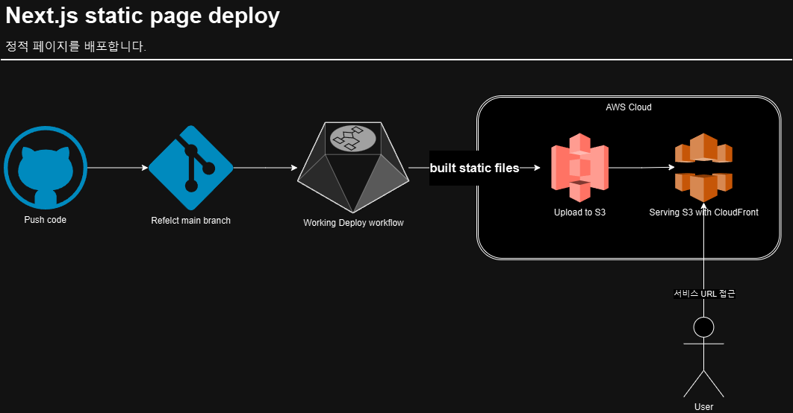
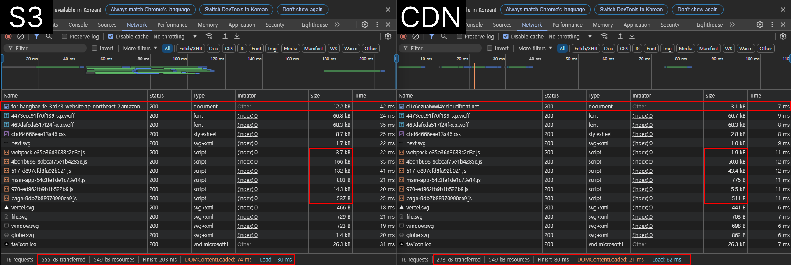

# 프론트엔드 배포 파이브라인

## 배포 flow

1. 기본적으로 `main` 브랜치에 `push`가 일어나면 workflow가 동작합니다.
2. 정적으로 build된 `/out`폴더 내의 모든 파일이 s3에 업로드됩니다.
3. cloudfront를 통해 서비스를 서빙 중입니다.
   - `--paths "/*"`를 경로로 지정하여 캐시된 모든 파일을 무효화하고 최신 버전을 제공합니다.

## 주요 링크

- S3 버킷 웹사이트 엔드포인트: for-hanghae-fe-3rd
- CloudFrount 배포 도메인 이름: d1x6ezuaiwwi4x

## 주요 개념

- **GitHub Actions과 CI/CD 도구**:

  - 리포지토리에서 바로 소프트웨어 개발 워크플로를 자동화, 사용자 지정 및 실행
  - 반복적이고 필요한 작업들을 자동화하여 효율을 높임
  - 다양한 트리거에 맞는 편의 기능을 직접 작성하여 설정이 가능
    - e.g.) 릴리즈 버전 관리, PR 템플릿 자동 생성, 린드 체크, 자동 테스트 등등

- **S3와 스토리지**:

  - s3는 웹 기반 스토리지 서비스
  - 정적 웹사이트를 호스팅가능
  - 대용량 업로드 가능
  - 객체마다 접근권한 설정 가능
  - 데이터 백업 및 복원 가능
  - 다양한 형태의 데이터 저장 가능

- **CloudFront와 CDN**:

  - 정적 및 동적 웹 콘텐츠를 최종 사용자에게 빠르게 제공하는 콘텐츠 전송 네트워크(CDN)
  - 전 세계에 분산된 엣지 로케이션을 통해 콘텐츠를 빠르게 전달
  - 정적/동적 콘텐츠를 캐싱하여 사용자에게 더 빠른 응답 제공
  - 웹사이트의 전반적인 성능 향상
  - S3와 통합하여 정적 웹사이트의 전송 속도 개선, 물리적으로 가까운 서버에 캐시 데이터를 둠

- **캐시 무효화(Cache Invalidation)**:

  - CDN에서 캐시된 콘텐츠를 삭제하거나 업데이트하여 최신 콘텐츠를 제공하는 프로세스
  - 배포 후 캐시 무효화를 통해 사용자가 최신 콘텐츠를 즉시 받을 수 있음
  - CloudFront의 캐시를 무효화하여 변경된 콘텐츠가 즉시 반영되도록 함

- **Repository secret과 환경변수**:
  - Repository secret은 GitHub에서 제공하는 보안 기능
  - AWS 자격 증명과 같은 민감한 정보를 안전하게 저장
  - GitHub Actions 워크플로우에서 환경변수로 사용 가능
  - 코드에 직접 노출하지 않고 안전하게 사용 가능
  - CI/CD 파이프라인에서 필요한 인증 정보를 안전하게 관리

## 성능 비교표

- 가까운 서버에서 캐싱된 데이터를 받아오기에 시간과 크기가 작다.
- 같은 크기의 파일인 경우 -> CDN에서도 원본 파일을 그대로 사용하거나 압축이 적용되지 않은 파일
